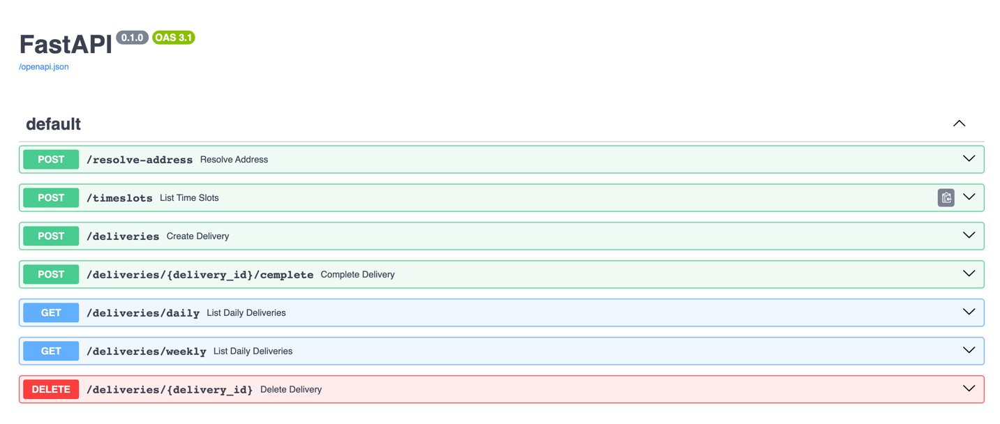

# Drop it BE interview solution
This repo contains the solution for DropIt home assignment. This project contains a simple http server written with python 3.9, runs with FastAPI and SQLAlchemy, saves application state to MySql and uses the following 3rd party apis: [holidays](https://holidayapi.com/) api and [geoapify](https://www.geoapify.com/).
## Prerequisites
- Docker compose

## Running it locally
- Copy `.env.tmp` to `.env` and fill the missing variables.
- Run the command: `$ docker compose up`.

## How to use the service
After running with docker compose you can navigate to http://localhost:8000/docs and uses the built in openapi docs.

## Project Structure
- [main.py](main.py) - Project entrypoint, spin the http server
- [orms.py](orms.py) - ORM, define tables mapping objects and db connections.
- [models.py](models.py) - Pydantic models for serialization and validation.
- [views.py](views.py) - Http interface layer, routes, middlewares.
- [service.py](service.py) - Logic layer.

## To do
- Add more tests
- Add application metrics (http request time, fail ratio etc..)
